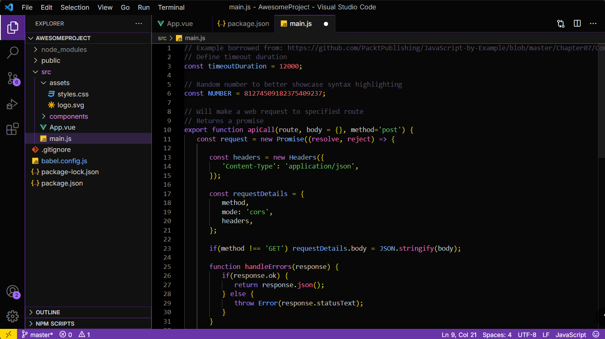

# 🌌 Violet Night Theme for VS Code

**Violet Night** is a sleek, dark, and vibrant Visual Studio Code theme featuring violet accents and soft contrast. It’s designed for simplicity to reduce eye strain during long sessions while maintaining just enough colour variety to stay visually engaging. With deep purples, warm yellows, and gentle contrast, it's perfect for night-time or low-light coding.

---

## ✨ Features

- Deep violet and dark gray base for low-glare comfort
- Vibrant but balanced syntax highlighting
- Enhanced visibility and affects for scrollbar, widgets, and more
- Semantic token support for better language features

---

## 📸 Preview



---

## 🔧 Installation

### 📦 Install via VS Code Marketplace

1. Open VS Code
2. Go to the Extensions view: `Ctrl+Shift+X`
3. Search for **Violet Night Theme**
4. Click **Install**

Or install directly from the [Marketplace page](https://marketplace.visualstudio.com/items?itemName=MaryamRezaee.violet-night-theme).

---

### 📁 Manual Installation (from `.vsix`)

1. [Download the `.vsix` file](./violet-night-theme-0.2.0.vsix)
2. Open VS Code
3. Press `Ctrl+Shift+P` and run:  
   `Extensions: Install from VSIX...`
4. Select the downloaded `.vsix` file and install

---

## 📂 Development & Contribution

Clone the repo and open in VS Code for local development:

```bash
git clone https://github.com/msmrexe/violet-night-vscode-theme.git
cd violet-night-vscode-theme
code .
```

After making changes, you can repackage and test using:

```bash
vsce package
code --install-extension violet-night-theme-0.2.0.vsix
```

---

## 📬 Contact

For questions, suggestions, or bugs, feel free to reach out:

- **Email:** [ms.maryamrezaee@gmail.com](mailto:ms.maryamrezaee@gmail.com)
- **GitHub:** [@msmrexe](https://github.com/msmrexe)

---

## 📝 License

This theme is open source under the [MIT License](LICENSE).

---

Enjoy your coding under the Violet Night sky! 🌃